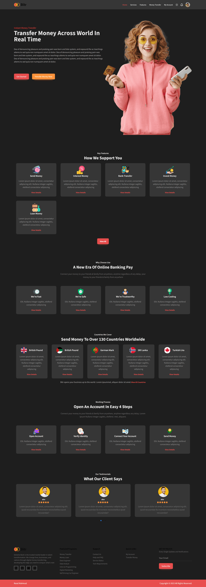

# ExtremeBank (CLIENT)
### A online banking site
## Repo: https://github.com/rasel-mahmud-dev/extreme-bank/tree/with-mysql/client
## Live: https://extreme-bank.web.app/

### test user
Email: rasel.mahmud.dev@gmail.com 
password: 12345

## Application Features
- user can create own account and bank account. 
- customer can send money to anther user account via account no
- Implement user-friendly form validator (custom).
- Customer can take loan for study business, house purpose with 10% annual interest, 
- They not able to take another loan it they not complete current loan all EMI.
- Also they can deposit money (annual rate 5% interest)
   
   
- This site implementation more feature continuously...

## Technology used.
- Reactjs
- react-router-dom
- Tailwindcss
- Firebase
- stripe
- react-spinners
- react-icons
- swiper
- axios

# ExtremeBank (Backend + With MYSQL)

## Repo: https://github.com/rasel-mahmud-dev/extreme-bank/tree/with-mysql
## Live: https://extreme-bank.vercel.app

## Functional requirement. 
- customer can create their account. also they can create their bank account with account no 16 digit.
- customer can send money to other user account no. 
- customer can take money loan with 10% annual interest. 
 (This calculation implement with simple interest formula) A*(1+(r*t))
 
 
- customer submit EMI for current month or future month. customer can't take another loan 
  if they already take a loan, not paid all EMI.  
-

## Database.
- Mysql (Native)

## Packages uses.
- Expressjs
- cors
- dotenv
- jwt(jsonwebtoken)
- bcryptjs
- mysql database
- winston logger

#### Auth/User endpoint
- [POST] api/v1/auth/login  user login
- [POST] api/v1/auth/registration user registration
- [GET] api/v1/auth/current-auth  fetch current logged user
- [GET] api/v1/auth/logout logout current user delete cookie from browser

#### Account endpoint
- [POST] api/v1/account create a bank account
- [GET] api/v1/account  [account detail for logged user]
- [GET] api/v1/account/peoples transactions able peoples
- [GET] api/v1/account/transactions  all transactions for logged user
- [POST] api/v1/account/transactions make new money transactions
- [GET] api/v1/account/loans  get all past all loans history
- [POST] api/v1/account/loan-money  create a load
- [GET] api/v1/account/emis  get all monthly emi for current logged user
- [POST] api/v1/account/submit-emi  submit a monthly emi

## Preview of Site

.png)
.png)
.png)
.png)
